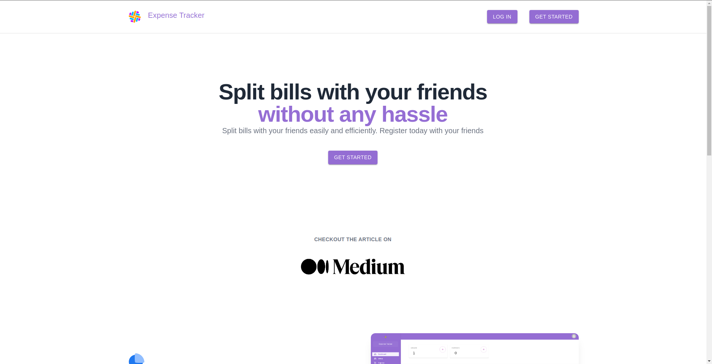
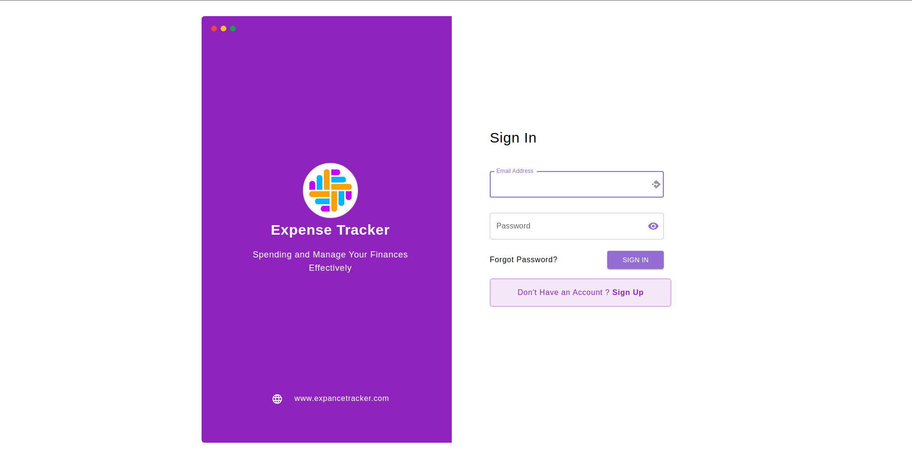
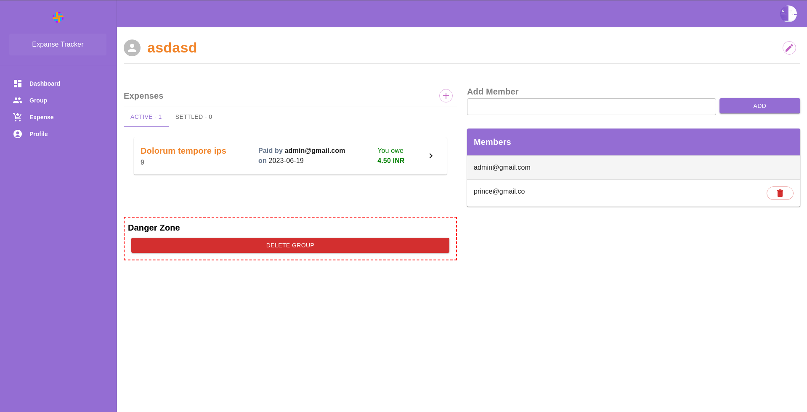
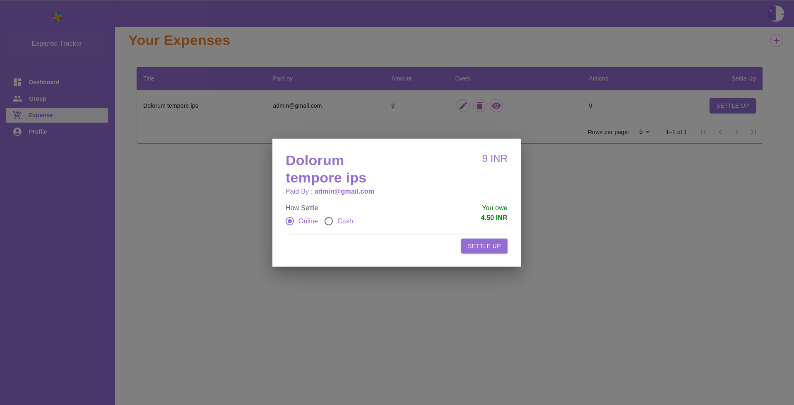

# 
Expense Tracker

---

## Live Working Link

---

 

- [https://expense-tracker-910c0.web.app/](https://expense-tracker-910c0.web.app)

 

---

## Used Language and Library

---

- Html
- Css
- Mui
- Javascript
- ReactJs
- Redux
- React-router-dom
- Firebase
- netlify
- circleci

 

---

## Project Setup

---

 

- ### **Recommended IDE Setup**

  > VsCode/ sublime text

- ### **Update .env**

  > create .env file

  > set firebase configration in .env

- ### **Install Package**

  > `npm install`

- ### **Compile and Hot-reload for Development**

  > `npm run dev`

- ### **Type Check, Compile and Minify for Production**

  > `npm run build`

 

## Description :

- The Expense Tracker project is a web or mobile application designed to help individuals or businesses keep track of their expenses. It provides a user-friendly interface that allows users to record and categorize their expenses, monitor their spending habits, and gain insights into their financial activities. The primary goal of the Expense Tracker is to provide users with a comprehensive overview of their expenditures, helping them make informed decisions about their finances.

- ## **Key Feature**

  - User Registration and Authentication
    - Allow users to create accounts and log in securely.
    - Implement password management and recovery features.
    - Use authentication measures to protect user data.
  - Expense Tracking
    - Allow users to input their bills
    - Provide fields for date, description, amount, and split with friends.
    - Support multiple currency options for international users.
    - Enable users to edit or delete expenses.
  - create a group of friends for split expance
  - Settlements : admin able to settle payment when due bills are paid
  <!-- - History : History of old bills -->
  - Reports and Analytics
  - Reports and Analytics:
    - Generate reports summarizing expense data for a specific time period.
    - Provide charts and graphs to visualize spending patterns.
  - Responsive Design:
    - Develop a responsive and user-friendly interface that works well on different devices and screen sizes.

<!-- **Note** : Project Feature are derived based on Project Requirement it may be vary with development requirement. -->

 

---

## Live Project Demo

---

 

